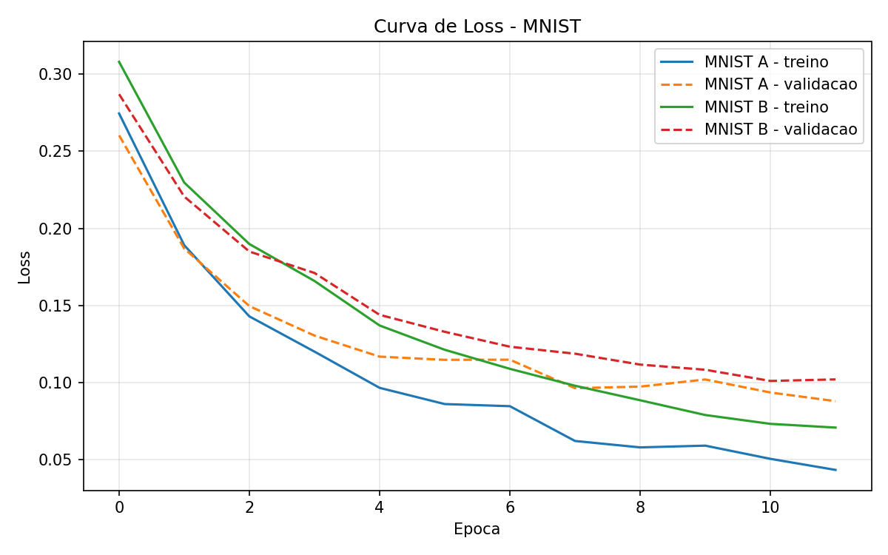
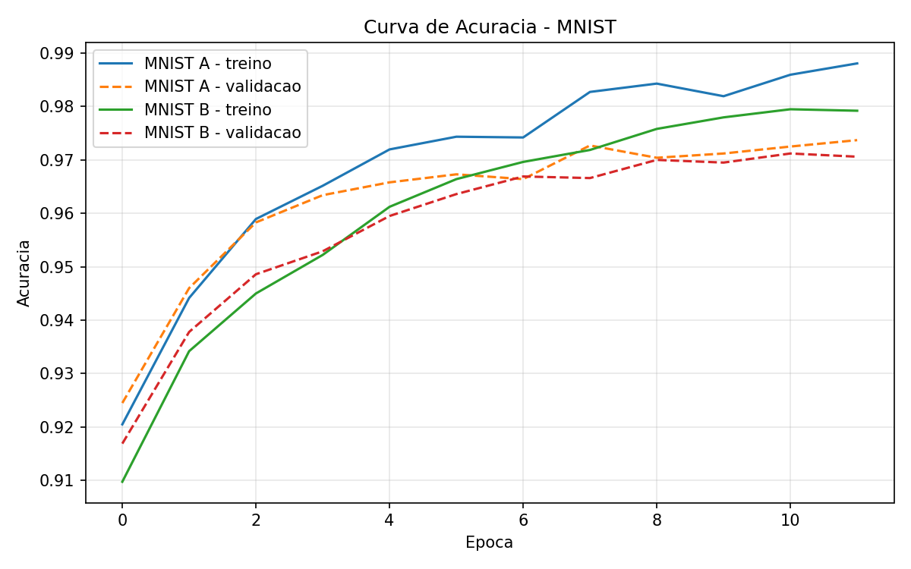

# MLP do Zero

## Descrição do Projeto

Este projeto implementa um Multi-Layer Perceptron (MLP) do zero para classificação de dígitos manuscritos do dataset MNIST.

A proposta principal foi entender o funcionamento interno de uma rede neural, sem usar frameworks de deep learning para treinar o modelo. Por isso, todo o núcleo da rede foi implementado manualmente com NumPy: forward pass, backpropagation, cálculo dos gradientes, função de perda e atualização dos pesos com SGD.

Usei TensorFlow/Keras apenas como referência permitida para carregamento do MNIST. Durante a execução neste ambiente, como a instalação do TensorFlow não terminou, carreguei diretamente o arquivo `mnist.npz` hospedado no mesmo endereço usado pelo Keras. O treinamento continuou sendo feito pela minha implementação em NumPy.

## Como Rodar

Instale as dependências:

```bash
python -m pip install -r requirements.txt
```

Execute o notebook:

```bash
jupyter notebook notebooks/experimentos.ipynb
```

No notebook estão os experimentos sintéticos, os experimentos no MNIST e a geração dos arquivos em `results/`.

## Estrutura do Repositório

```text
.
|-- README.md
|-- requirements.txt
|-- mlp/
|   |-- __init__.py
|   |-- activations.py
|   |-- losses.py
|   |-- network.py
|   `-- optimizers.py
|-- notebooks/
|   `-- experimentos.ipynb
`-- results/
    |-- experimentos_comparativos.csv
    |-- loss_comparativo.svg
    |-- accuracy_comparativo.svg
    |-- mnist_experimentos.csv
    |-- mnist_loss.png
    `-- mnist_accuracy.png
```

## Arquitetura da Rede

A melhor configuração obtida no MNIST foi:

```text
784 -> 128 -> 64 -> 10
```

Isso significa:

- `784` entradas: cada imagem 28x28 do MNIST foi achatada em um vetor com 784 pixels.
- `128` neurônios na primeira camada oculta.
- `64` neurônios na segunda camada oculta.
- `10` neurônios na saída, um para cada dígito de 0 a 9.

Usei ReLU nas camadas ocultas e Softmax na camada de saída.

## Funcionamento do MLP

O forward pass é o caminho da entrada até a previsão final. Em cada camada, a rede calcula:

```text
Z = A_anterior @ W + b
A = ativação(Z)
```

Onde:

- `A_anterior` é a saída da camada anterior.
- `W` são os pesos.
- `b` são os vieses.
- `Z` é o valor linear antes da ativação.
- `A` é a saída ativada da camada.

Nas camadas ocultas, usei ReLU:

```text
ReLU(x) = max(0, x)
```

Ela é importante porque adiciona não linearidade. Sem uma função de ativação não linear, várias camadas empilhadas ainda seriam equivalentes a uma única transformação linear.

Na saída, usei Softmax:

```text
softmax(z_i) = exp(z_i) / soma(exp(z_j))
```

O Softmax transforma os valores finais da rede em probabilidades. Assim, a saída pode ser interpretada como a probabilidade de cada classe.

Para medir o erro, usei Cross-Entropy:

```text
loss = -soma(y_real * log(y_predito))
```

Essa loss penaliza a rede quando ela atribui baixa probabilidade à classe correta.

## Backpropagation

O backpropagation foi a parte mais importante da implementação. Ele calcula quanto cada peso e cada viés contribuíram para o erro final.

Na camada de saída, usei a simplificação de Softmax com Cross-Entropy:

```text
dZ = y_pred - y_true
```

Depois, para cada camada, calculei:

```text
dW = A_anterior.T @ dZ / batch_size
db = soma(dZ) / batch_size
dA_anterior = dZ @ W.T
```

Nas camadas ocultas, também multipliquei pela derivada da ReLU:

```text
dZ = dA * ReLU'(Z)
```

Para conferir se os gradientes estavam corretos, fiz uma checagem numérica por diferenças finitas em um problema pequeno. A diferença máxima obtida foi:

```text
max_diff = 1.05e-11
```

Esse resultado me deu confiança de que o backpropagation estava coerente.

## Inicialização dos Pesos

Usei He Initialization:

```text
W = valores aleatórios com média 0 e desvio padrão sqrt(2 / fan_in)
b = zeros
```

Escolhi essa inicialização porque a rede usa ReLU nas camadas ocultas. Como a ReLU zera valores negativos, parte dos sinais deixa de passar para a próxima camada. A He Initialization ajuda a manter a escala dos valores mais estável durante o forward pass.

Também considerei Xavier Initialization, mas ela costuma ser mais adequada para ativações como `sigmoid` e `tanh`. Para ReLU, He Initialization fez mais sentido.

## Otimizador

Implementei SGD manualmente:

```text
parâmetro = parâmetro - learning_rate * gradiente
```

A parte mais importante aqui foi lembrar que o gradiente aponta a direção de maior aumento da loss. Então, para reduzir o erro, eu preciso andar na direção oposta ao gradiente.

## Treinamento

O treinamento usa mini-batches. Em vez de atualizar os pesos com uma única amostra ou com o dataset inteiro de uma vez, a rede usa pequenos blocos de dados.

O fluxo de treino de um batch é:

```text
1. Converter rótulos para one-hot
2. Fazer forward pass
3. Calcular cross-entropy
4. Fazer backpropagation
5. Atualizar pesos e vieses com SGD
```

O método `fit` registra:

- loss de treino;
- acurácia de treino;
- loss de validação;
- acurácia de validação.

Essas métricas foram usadas para comparar configurações.

## Experimentos

Antes do MNIST, testei a rede em um dataset sintético simples. Fiz isso porque, se o MLP não aprendesse um problema pequeno e separável, provavelmente haveria erro na implementação.

Depois, executei dois experimentos no MNIST:

```text
MNIST A:
Arquitetura: 784 -> 128 -> 64 -> 10
Learning rate: 0.1
Batch size: 128
Épocas: 12

MNIST B:
Arquitetura: 784 -> 256 -> 128 -> 10
Learning rate: 0.05
Batch size: 128
Épocas: 12
```

## Resultados no MNIST

| Configuração | Arquitetura | LR | Batch | Épocas | Acurácia Validação | Acurácia Teste | Loss Teste |
| --- | --- | --- | --- | --- | --- | --- | --- |
| MNIST A | 784 -> 128 -> 64 -> 10 | 0.1 | 128 | 12 | 0.973700 | 0.974600 | 0.083006 |
| MNIST B | 784 -> 256 -> 128 -> 10 | 0.05 | 128 | 12 | 0.970600 | 0.968600 | 0.101009 |

A melhor configuração foi a **MNIST A**, com:

```text
Acurácia no teste: 97,46%
Loss no teste: 0.083006
```

A meta mínima da atividade era 92% de acurácia no conjunto de teste. A implementação atingiu essa meta.

## Gráficos

Curva de loss no MNIST:



Curva de acurácia no MNIST:



Também gerei resultados preliminares dos experimentos sintéticos:

- `results/experimentos_comparativos.csv`
- `results/loss_comparativo.svg`
- `results/accuracy_comparativo.svg`

## Decisões e Dificuldades

### Decisão Técnica Mais Difícil

A decisão técnica mais difícil foi escolher e validar a inicialização dos pesos e o backpropagation. No começo, parece que inicializar pesos é só um detalhe, mas entendi que isso afeta diretamente se a rede aprende ou não.

Eu poderia ter usado valores aleatórios pequenos sem pensar muito, mas escolhi He Initialization porque estava usando ReLU. Essa escolha fez sentido porque a ReLU zera parte das ativações, e a He Initialization ajuda a manter os sinais em uma escala mais adequada.

Outra decisão importante foi validar os gradientes antes de ir para o MNIST. Eu sabia que, se a loss não caísse, o problema provavelmente estaria em alguma derivada ou transposta errada. Por isso fiz gradient checking em um caso pequeno.

### O Que Tentei Que Não Funcionou

Uma dificuldade real foi o ambiente. A instalação completa das dependências com TensorFlow não terminou neste runtime. O `matplotlib` chegou a ser instalado, mas o TensorFlow não concluiu mesmo após uma tentativa mais longa.

Para resolver sem abandonar o requisito, carreguei diretamente o arquivo `mnist.npz` hospedado pelo Keras. Isso não mudou a implementação da rede, porque o dataset foi apenas carregado de outro jeito. O treinamento continuou sendo feito com NumPy.

Também tive pequenos problemas durante os testes com comandos inline no PowerShell, principalmente por causa de aspas e f-strings. Isso me ensinou a separar melhor o que era erro do ambiente de execução e o que era erro real da implementação.

Outra dificuldade comum foi acompanhar os shapes das matrizes. Em uma rede neural, muitas fórmulas parecem simples no papel, mas uma transposta errada já quebra tudo. Por isso passei a conferir sistematicamente os formatos de `W`, `b`, `dW`, `db`, `A` e `Z`.

### O Que Aprendi

Aprendi que o MLP é uma sequência organizada de operações matriciais. O mais importante não é decorar a fórmula, mas entender o fluxo:

```text
entrada -> transformação linear -> ativação -> loss -> gradientes -> atualização
```

Também aprendi que o backpropagation depende muito dos valores armazenados no forward pass. Por isso o cache com `A` e `Z` foi essencial.

Outro aprendizado foi que acurácia alta não aparece só por escolher uma arquitetura grande. A configuração menor, `784 -> 128 -> 64 -> 10`, teve resultado melhor que a maior neste teste. Isso reforçou que otimização envolve observar métricas, não apenas aumentar neurônios.

### O Que Eu Faria Diferente

Se eu refizesse do zero, eu criaria desde o começo um arquivo separado de testes automatizados para cada parte da rede. Durante o desenvolvimento, fiz testes básicos por comandos, mas seria melhor deixar esses testes versionados.

Também criaria uma função utilitária específica para carregar datasets, separando o carregamento do MNIST do notebook. Isso deixaria o notebook mais limpo.

Por fim, eu teria planejado o ambiente antes de chegar ao MNIST. A dificuldade com TensorFlow mostrou que dependências grandes podem virar um problema mesmo quando a implementação da rede está correta.

## Histórico de Desenvolvimento

O desenvolvimento foi incremental. Alguns commits importantes foram:

- criação da estrutura inicial do projeto;
- implementação da ReLU e derivada;
- implementação do Softmax e Cross-Entropy;
- inicialização dos pesos com He Initialization;
- forward pass;
- backpropagation;
- SGD;
- treinamento por mini-batches;
- métricas de otimização;
- experimentos comparativos;
- execução no MNIST;
- geração dos resultados finais.

Esse histórico ajudou a manter cada parte pequena o suficiente para testar e explicar.

## Conclusão

O projeto atingiu o objetivo principal da atividade: implementar um MLP do zero usando NumPy e treinar no MNIST com acurácia acima de 92%.

O melhor resultado foi:

```text
97,46% de acurácia no conjunto de teste
```

Mais importante do que o número final, este projeto me ajudou a entender como uma rede neural aprende internamente: como os dados passam pelas camadas, como a loss mede o erro, como os gradientes são calculados e como o SGD ajusta os parâmetros.
